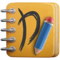
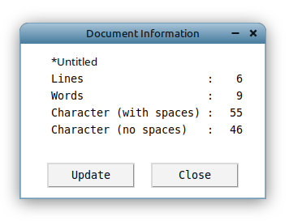
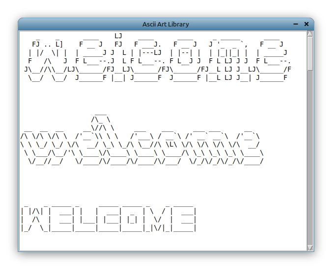
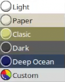
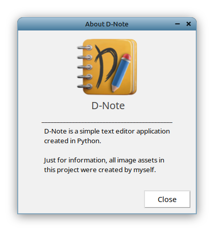
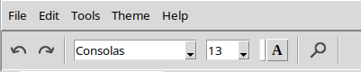
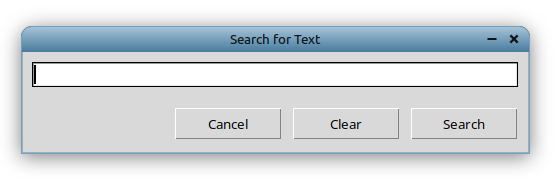

# D-Note text editor

A simple text editor application built with Python.

Quick info: All image assets in this application are made by myself.

## Feature include:

File | Edit | Tools |
--- | --- | --- |
writing a text file | copy | document information 
save your file | paste | time and date (print out current time and date)
open a text file | cut | Ascii art library 
create a new file | select all |

Theme | Help | Others |
--- | --- | --- |
 |  about the D-Note  | undo, redo, font style, text size, text color, and search for text 
||| search a word 
||| status bar 

